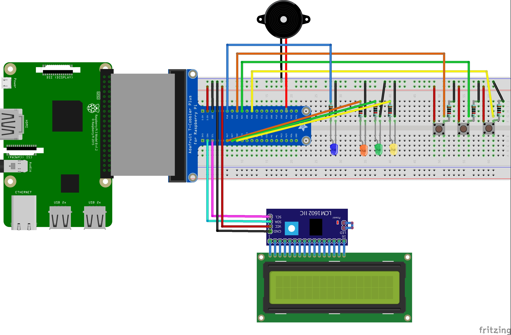

# J5 Raspberry Memory Game

A simple game to test your memory skills. You will be required to remember and reproduce a sequence of colors that varies with each match. You can also manage the difficulty level by selecting the speed in which the sequence is shown.

## Build the electronic circuit

Components needed:

- 1x Raspberry Pi 3 Model B+
- 1x Board
- 1x Raspberry Pi GPIO Extension Board (optional)
- 3x Buttons
- 1x Orange button cover (optional)
- 1x Green button cover (optional)
- 1x Yellow button cover (optional)
- 1x Blue led
- 1x Orange led
- 1x Green led
- 1x Yellow led
- 7x 10KΩ Resistor
- 1x Buzzer
- 1x Blue wire
- 2x Orange wires
- 2x Green wires
- 2x Yellow wires
- 9x Black wires
- 5x Red wires
- A lot of curiosity :-)



> Disclaimer: An incorrect connection or a defective component may damage your Raspberry PI so always double check connections and components. If using a different components always check the data sheet and adapt circuit accordingly.

## How to install

Before you start you need to know that this game has been tested on [Raspberry Pi 3 Model B+](https://www.raspberrypi.org/products/raspberry-pi-3-model-b-plus/) with [Raspbian](https://www.raspberrypi.org/downloads/raspbian/) operating system and it was written using the javascript [Johnny-Five](http://johnny-five.io/) framework.

### Install node js on your Raspberry Pi

Since it is necessary to have node installed on the Raspberry I advise you to read the guide: [Getting a Raspberry Pi ready for NodeBots](https://github.com/nebrius/raspi-io/wiki/Getting-a-Raspberry-Pi-ready-for-NodeBots)

Open a terminal:

```console
$ cd j5-raspberry-memory-game/
$ npm install
```

## Start the game

Open a terminal:

```console
$ sudo node index.js
```
